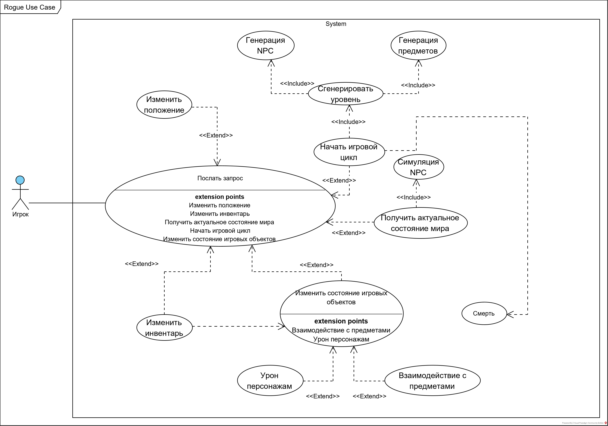
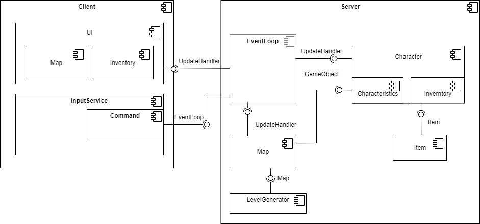
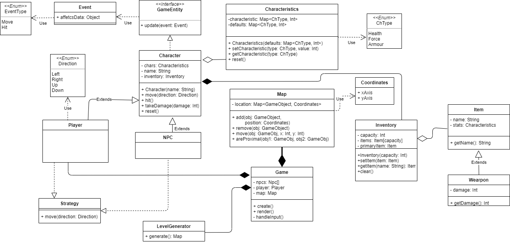

<<<<<<< HEAD
# Rougelike
---
## Общие сведения о системе
Решение предусматривает следующие понятия:
1. Мир - совокупность игрового уровня, с предметами для взаимодействия и персонажами.
2. Игрок - персонаж, контролируемый пользователем. 
3. NPC (или моб) - персонаж, контролируемый системой. 
4. Инвентарь - совокупность предметов, которые находятся в расположении персонажа 
5. Предмет для взаимодействия - объект игрового мира, который допускает интерактивную составляющую между персонажами. 
6. Уровень - изначальное состояние сгенерированной карта мира с NPC и предметами для взаимодействия.
7. Характеристики - количественные показатели уровня игрока (очки здоровья, урон, броня)
8. Очки здоровья - численная характеристика, когда опускается до 0, персонаж более неактивен. 

Решение приложения базируется на клиент-серверной архитектуре. Клиент, он же игрок, посылает запросы на изменение своего положения и взаимодействия с миром, а также хранит актуальную информацию о том, как выглядит мир. Серверная часть содержит себе логику обработку всех событий, к которым можно отнести следующее:
- генерации мира
- изменение уровня
- создание и обработка событий

Таким образом, ключевой паттерн, лежащий в работе приложения - это событийная модель. 

## Architectural drivers
1. Требования 
    1.  Автоматическая генерация уровня 
    2. Поддержка инвентаря 
    3. Консольное приложение (*по возможности* предоставить добротный GUI)
    4. Масштабируемость системы 
    5. Поддержка многопользовательского режима (Future) 
    6. Взаимодействие клиента с сервером происходит по websocket-ам
2. Случаи использования (Use Case диаграммы)

3. Ограничения
    1. Размер уровня неизменяемый 
    2. Инвентарь поддерживает не больше 4 предметов - верхняя граница задавается на усмотрение команды разработки 
    3. Многопользовательский режим не поддерживается в alpha-версии 
    4. Число игроков на уровне ограничено 
    5. Нет гарантий на человеко-подобное поведение NPC 
    6. Платформа JVM (кроссплатформенность)
    7. Сопровождаемость (документация, тесты)
    8. Расширяемость (можно добавлять новые типы игроков, предметы) 
    9. Игровой формат - вид сверху 

## Диаграмма компонентов

Распределение между участниками: 
- Костя Третьяков: Player, Inventory, Characteristics, NPC’s, InputService
- Коля Егоров: LevelGenerator, Map, NPC behaviuor + generation, UI

## Уточнение классами 

=======
# rougelike
>>>>>>> 160daf330f47fd3585a700dd53a00c3c79f7eaa4
